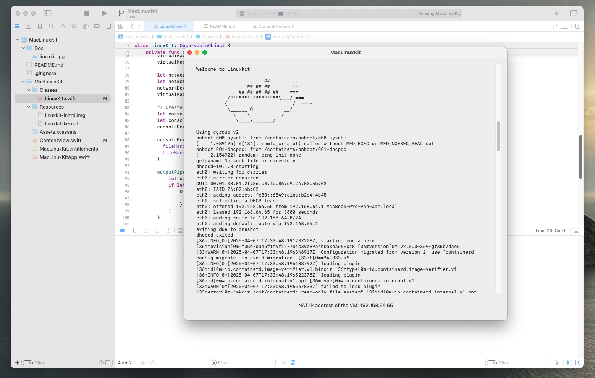

# MacLinuxKit

This is a proof of concept application to run a LinuxKit VM in a SwiftUI application and launch docker containers in it.

Kindly not that his is extremely early, experimental and being worked on.

## Resources

The LinuxKit image is not included in this repository. You can find an example at my [snippetd](https://github.com/jankammerath/snippetd) project which allows spawning containers and executing arbitrary code within them. The `linuxkit-initrd.img` and the `linuxkit-kernel` _(uncompressed!)_ need to be in the `MacLinuxKit/Resources` folder.
